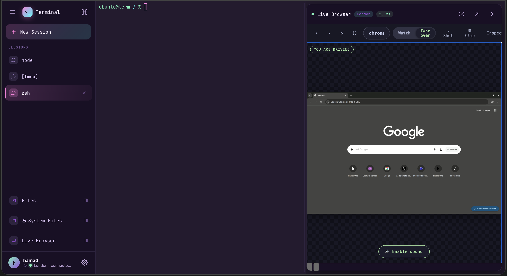
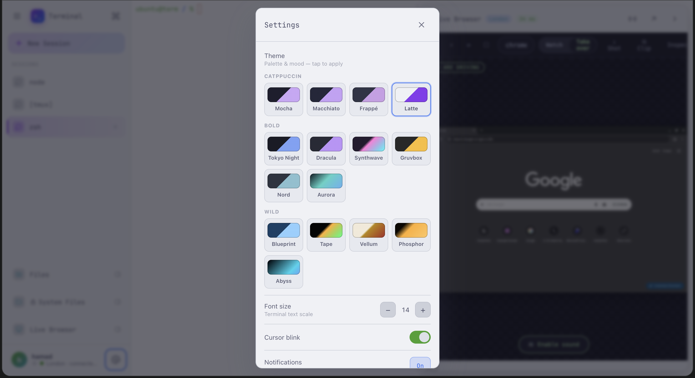
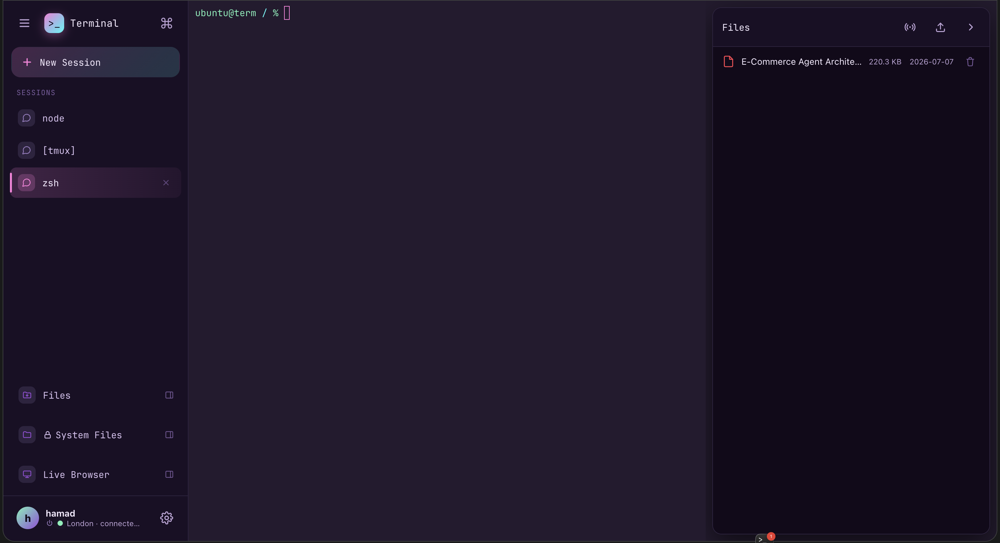
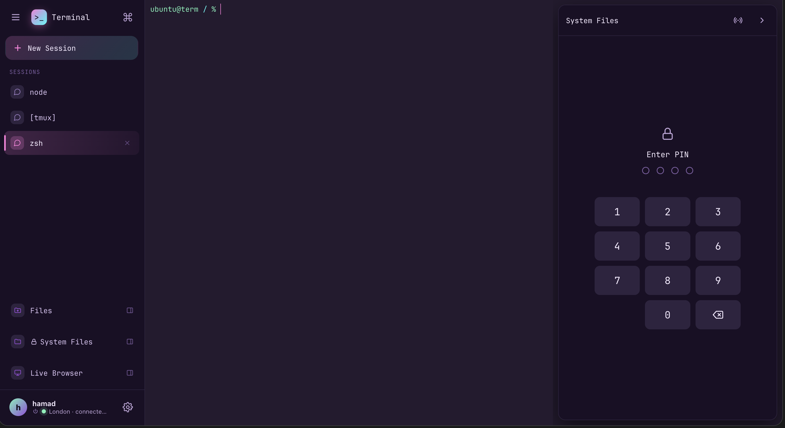
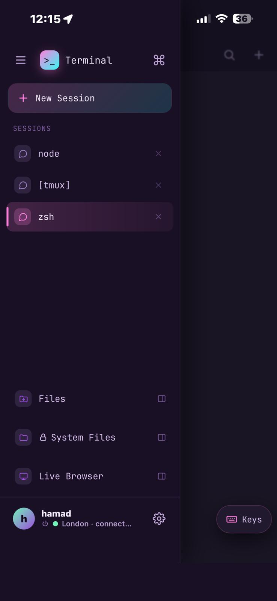
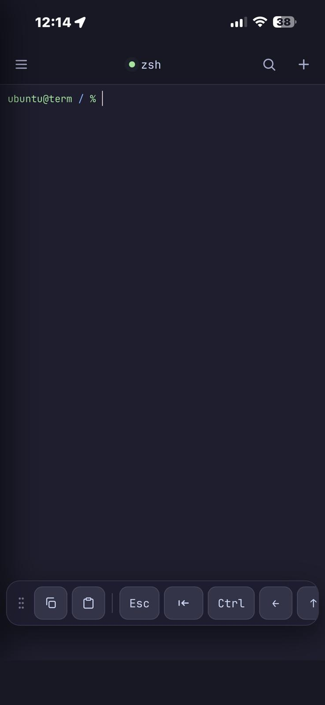
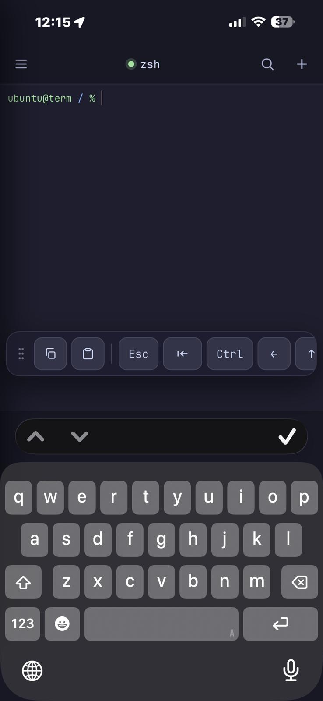
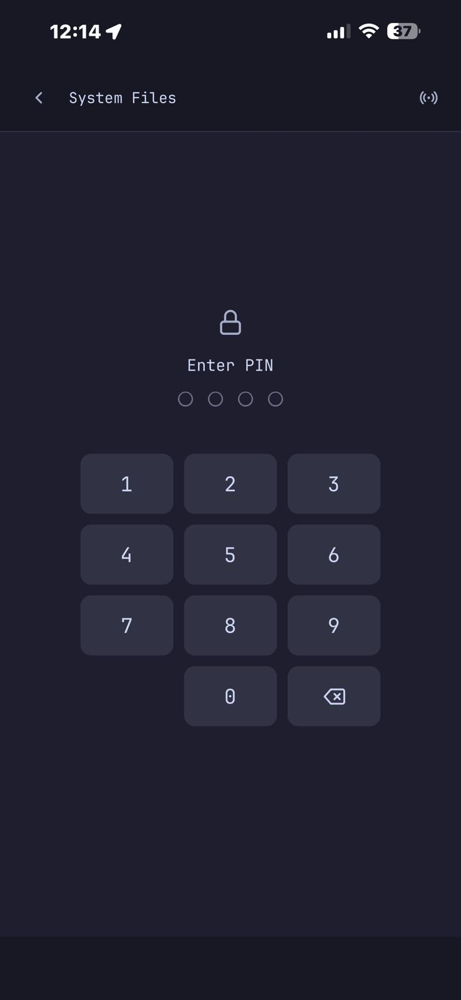
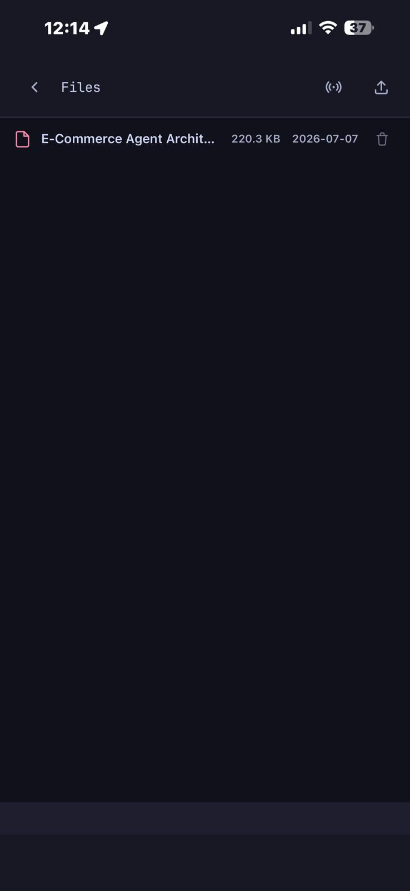
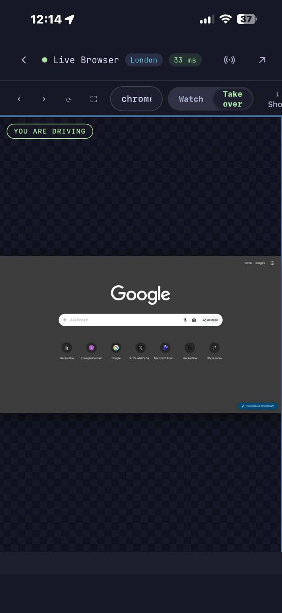

<h1 align="center">🪐 Skyshell</h1>

<p align="center">
  <b>Your always-on cloud machine, in your pocket.</b><br>
  A self-hosted, phone-first <b>web terminal</b> + a <b>watchable browser on a residential IP</b>
  that you <i>and your AI</i> can drive — behind one login, with <b>zero open ports</b>.
</p>

<p align="center">
  <a href="#quick-start">Quick start</a> ·
  <a href="docs/ARCHITECTURE.md">Architecture</a> ·
  <a href="docs/LIVE-BROWSER.md">The live browser</a> ·
  <a href="docs/CONNECT-YOUR-AI.md">Connect your AI</a> ·
  <a href="docs/DEPLOY.md">Deploy</a>
</p>

<p align="center">
  
  
  
  
</p>

---

## What is this?

Skyshell turns a cheap always-on Linux server into a **private cockpit you reach from any browser** — your phone on the train, a borrowed laptop, a tablet on the couch. Open one URL, pass one login, and you're dropped straight into:

- a **real terminal** (your shell, your tools, your AI coding agent), with sessions that survive disconnects and reboots, and
- a **live browser** running *on the server* that you can **watch and click**, which reaches the web through a **residential IP** so sites treat it like a normal home visitor — not a flagged datacenter bot.

The whole thing is served through a **Cloudflare Tunnel**, so the server opens **no inbound ports at all** — there is nothing on the public internet to port-scan. And it installs to your home screen as a **PWA**, so it opens full-screen like a native app.

> **"shell in the sky"** — a shell (terminal) that lives in the cloud and follows you everywhere. That's the name, and that's the whole idea.

This repo is a **skeleton**: the real, working code, fully sanitized, plus the config templates and docs to stand up your own. Bring your own server, your own domain, your own proxy, your own AI — every one of those is a placeholder you swap in.

---

## 🖼️ Screenshots

### Desktop

<table>
  <tr>
    <td align="center" width="50%"><br><sub><b>Terminal + Live Browser side-by-side — you're driving</b></sub></td>
    <td align="center" width="50%"><br><sub><b>15 themes, font size, cursor &amp; more</b></sub></td>
  </tr>
  <tr>
    <td align="center" width="50%"><br><sub><b>File browser panel</b></sub></td>
    <td align="center" width="50%"><br><sub><b>PIN-gated System Files</b></sub></td>
  </tr>
</table>

### Mobile

Phone-first, installed as a PWA — the whole cockpit in your pocket.

<table>
  <tr>
    <td align="center"><br><sub><b>Sessions &amp; panels</b></sub></td>
    <td align="center"><br><sub><b>Terminal + mobile key-bar</b></sub></td>
    <td align="center"><br><sub><b>Keyboard &amp; history nav</b></sub></td>
  </tr>
  <tr>
    <td align="center"><br><sub><b>PIN-gated System Files</b></sub></td>
    <td align="center"><br><sub><b>File browser</b></sub></td>
    <td align="center"><br><sub><b>Live Browser — you're driving</b></sub></td>
  </tr>
</table>

---

## The three pillars

### 🖥️ 1 — A terminal that follows you
`nginx → ttyd → tmux → your shell`

A custom **xterm.js** front-end (one self-contained `index.html`, no build step) speaking ttyd's WebSocket protocol, attached to a persistent **tmux** session. On top of the bare terminal it adds **tabs** (mapped to tmux windows), a **command palette**, **search**, **15 themes**, a **mobile key-bar** (arrows, Esc, Ctrl, Tab, pipe…), **haptics**, a **PIN-gated file browser**, **drag-and-drop upload** (drop files or whole folders onto the terminal), a **right-click clipboard menu** (with OSC 52, so tmux/vim yanks land in your device clipboard), **click-to-download file links** (file paths printed in terminal output become links, each validated live against the server before download), and **PWA install**. Your work survives disconnects *and* reboots.

### 🌐 2 — A watchable browser on a residential IP
`headless Chromium on :99  →  local proxy  →  your residential exit IP`

A real, headed **Chromium** runs on a virtual display on the server, routed through a forward proxy that upstreams to a **residential proxy** — so it browses as if from a home connection, not the datacenter. You **watch and drive** it live inside the app (URL bar, back/forward, click-through, scroll, rotate) over **KasmVNC**, or over a lower-latency **WebRTC** cockpit (H.264/Opus). It's **stealth-hardened** — matching timezone/locale, no WebRTC IP leak, a real WebGL context — so it presents cleanly instead of reading as a bot. → [**How it works**](docs/LIVE-BROWSER.md)

### 🤖 3 — Your AI, in the loop
`Chromium CDP :9222  →  Playwright-MCP :8933  →  any MCP client`

The **same** browser you're watching is exposed over Chrome DevTools Protocol and a **Playwright MCP** endpoint. Point **any** local or API-connected model at it — Claude Code, a local LLM, your own agent — and it can **browse the live internet from your residential IP while you watch it happen**. Not a screenshot service; the actual live session, shared between you and the model. → [**Connect your AI**](docs/CONNECT-YOUR-AI.md)

---

## Architecture at a glance

```
        Your phone / laptop  (any browser, PWA-installable)
                     │  HTTPS · 443 only · nothing else exposed
                     ▼
        ┌───────────────────────────────┐
        │        Cloudflare edge         │
        │  • Tunnel (box dials OUT)      │   ← zero inbound ports on the server
        │  • Access (one login gate)     │
        └───────────────┬───────────────┘
                        │  encrypted tunnel
                        ▼
   ┌───────────────────────────────────────────────────────────────┐
   │  Your Linux server  (YOUR_SERVER_IP)                           │
   │                                                                │
   │   nginx :7690 ───────────────  the Skyshell app                │
   │     ├─ /              → index.html (xterm.js SPA + PWA)         │
   │     ├─ /ws  /token    → ttyd :7681 → tmux "main" → your shell   │
   │     ├─ /tabs /stats   → tabs service :7691 (Python)            │
   │     ├─ /bctl/*        → browser-control :7692 (→ xdotool)       │
   │     ├─ /browser/*     → KasmVNC :6081  (watch the live browser) │
   │     └─ /live2/*       → WebRTC cockpit :8934/:8935 (H.264)      │
   │                                                                │
   │   display :99 (Xvnc) ── window mgr ── live Chromium            │
   │        │                               │ --proxy → :8899        │
   │        │                               └ CDP :9222 ◄────┐       │
   │   local proxy :8899 (tinyproxy) ──► your residential exit IP    │
   │                                                          │       │
   │   Playwright-MCP :8933 ───────────────────────────────►─┘       │
   │        ▲  your AI (Claude Code / local model / agent) drives it │
   │                                                                │
   │   origin-auth :7697  — verifies the Access JWT at the origin    │
   └───────────────────────────────────────────────────────────────┘
```

Full service/port/endpoint tables: [`docs/ARCHITECTURE.md`](docs/ARCHITECTURE.md).

---

## Quick start

Skyshell is **built to run on a server** (that's the point — it's always on and reachable from anywhere). You can also run the core locally to try it out.

### On a server (the native use case)
You'll need: a Linux box (an ARM VM from any cloud works great), a domain on Cloudflare, and — for the live browser — a residential proxy subscription. Then:

```bash
git clone https://github.com/HamadYMarafi/skyshell.git
cd skyshell
cp .env.example .env          # fill in your host, tunnel, proxy…
cp infra/cloudflared/config.example.yml infra/cloudflared/config.yml
# …follow the step-by-step:
```
→ **[docs/DEPLOY.md](docs/DEPLOY.md)** walks the whole thing: Cloudflare Tunnel + Access, the residential proxy, the systemd units, nginx, and verification.

### Locally (kick the tyres)
Run just the terminal (and optionally the live browser) on your laptop, no Cloudflare, no proxy:

→ **[docs/LOCAL.md](docs/LOCAL.md)**

### Configure it for *your* stuff
Every hostname, port, proxy, and secret is a placeholder. One page maps exactly what to change and where:

→ **[docs/CONFIGURE.md](docs/CONFIGURE.md)**

---

## Repo layout

| Path | What's in it |
|---|---|
| `index.html` · `sw.js` · `manifest.json` | The single-file front-end (xterm.js SPA) + service worker + PWA manifest |
| `assets/` | xterm.js, the Nerd Font, icons |
| `server/` | The Python + shell services: terminal-tabs, browser-control, origin-auth, health, backup, live-browser helpers |
| `cockpit/` | The WebRTC "cockpit v2" live-browser view (CDP screencast bridge + WebRTC media server + input) |
| `infra/systemd/` | One `.service`/`.timer` per component — the whole system as units |
| `infra/nginx/` | The app vhost, the emergency vhost, security headers, the origin-auth wiring |
| `infra/cloudflared/` | The tunnel config template |
| `infra/kasmvnc/` | KasmVNC config + xstartup for the virtual display |
| `tools/` | Deploy pipeline, smoke test, theme checker, tests |
| `docs/` | Everything below |

**Docs:** [Architecture](docs/ARCHITECTURE.md) · [Deploy](docs/DEPLOY.md) · [Run locally](docs/LOCAL.md) · [The live browser](docs/LIVE-BROWSER.md) · [Connect your AI](docs/CONNECT-YOUR-AI.md) · [Configure](docs/CONFIGURE.md) · [Origin auth](docs/ORIGIN-AUTH.md) · [Updating a running instance](docs/UPDATING.md) · [Restore / DR](docs/RESTORE.md) · [Publishing this to GitHub](docs/PUBLISHING-TO-GITHUB.md)

---

## Tech stack

**Front-end:** vanilla JS + [xterm.js](https://xtermjs.org/), a service-worker PWA, no framework, no build step.
**Terminal:** [ttyd](https://github.com/tsl0922/ttyd) + [tmux](https://github.com/tmux/tmux).
**Live browser:** [Chromium](https://www.chromium.org/) on a virtual X display (KasmVNC's Xvnc) + a window manager, watched via [KasmVNC](https://github.com/kasmtech/KasmVNC) and a custom WebRTC pipeline (x264/Opus), driven via CDP + [Playwright MCP](https://github.com/microsoft/playwright-mcp).
**Residential egress:** [tinyproxy](https://tinyproxy.github.io/) → a residential proxy of your choice.
**Edge / auth:** [Cloudflare Tunnel](https://developers.cloudflare.com/cloudflare-one/connections/connect-networks/) + [Access](https://developers.cloudflare.com/cloudflare-one/policies/access/), plus an origin-side JWT verifier.
**Glue:** [nginx](https://nginx.org/), Python stdlib HTTP services, systemd, a git-gated deploy pipeline with auto-rollback.

---

## Status & honesty

This started as one person's personal cockpit and was hardened into something shippable — a git-gated deploy with automatic rollback, systemd hardening, structured monitoring/alerting, nightly backups, a reboot drill that found and fixed real boot-order bugs, and a measured latency pass on the live browser. It is **not** a turnkey product: it assumes you're comfortable on a Linux box and reading a service file. It's a **strong skeleton to fork**, not a one-click install.

Much of the engineering story is a *measure-don't-guess* one — the live-browser input path was rebuilt after profiling showed one OS process was being spawned per mouse event; end-to-end (glass-to-glass) latency was roughly halved by tuning capture rate, keyframe interval, and buffer depth with real numbers, not vibes.

---

## License & credits

MIT — see [LICENSE](LICENSE). Skyshell stands on the shoulders of the open-source
projects in the tech-stack list above; each keeps its own license — the bundled
ones (xterm.js, the Nerd-Font-patched JetBrains Mono, `ws`) are reproduced in
[THIRD-PARTY-LICENSES.md](THIRD-PARTY-LICENSES.md). Built with a
lot of help from an AI pair-programmer, which is only fitting given pillar #3.
